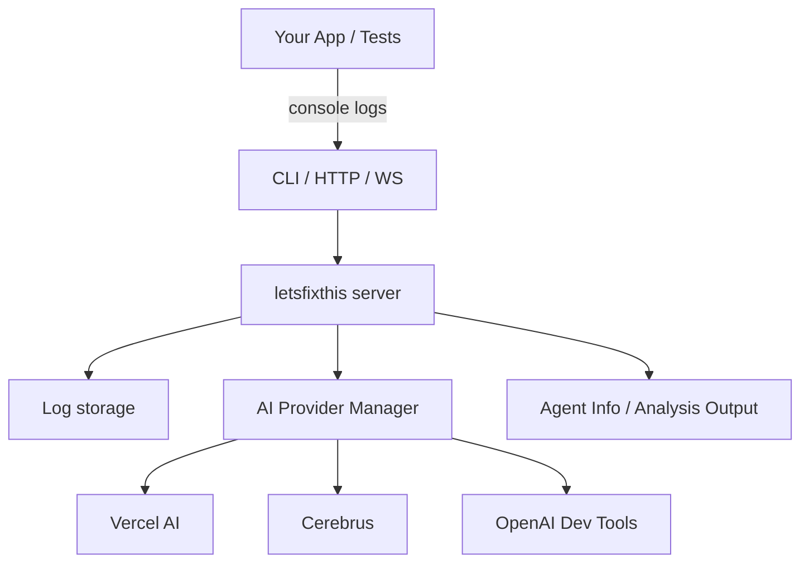
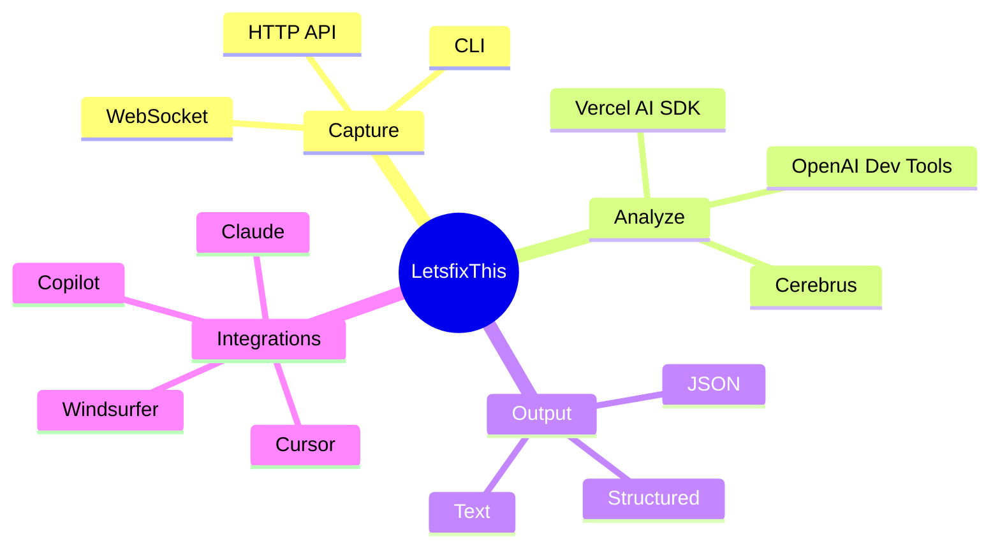

# LetsfixThis

[](./docs/index.md)
[](https://badge.fury.io/js/letsfixthis)
[](https://opensource.org/licenses/MIT)
[](https://github.com/haybaler/letsfixthis/actions)
[](https://npmjs.org/package/letsfixthis)

A powerful CLI tool that captures browser developer console output and makes it available for AI coding agents like Cursor, Claude Code, GitHub Copilot, Windsurfer, and development platforms like V0, Bolt, Lovable, and Replit.

## 🚀 Features

- **Real-time Console Capture** - Captures all console logs, warnings, errors, and network issues
- **AI Agent Integration** - Formats output specifically for different AI coding agents
- **Advanced AI Analysis** - Powered by Vercel AI SDK, Cerebras (provider id: `cerebrus`), and OpenAI Dev Tools
- Extension-free operation — capture via CLI, HTTP API, or WebSocket
- **Multiple Output Formats** - JSON, text, and structured formats
- **WebSocket & HTTP APIs** - Real-time streaming and REST endpoints
- **Cross-Platform** - Works with any development environment

## 📦 Installation

### Requirements
- Node.js 18.0.0 or higher
- npm 8.0.0 or higher

### AI Provider Setup (Optional)
For enhanced AI analysis, configure your API keys (focus: OpenAI + optional Cerebras routing). Different providers can use different keys without manual switching, via provider‑specific env vars or `.letsfixthis.keys.json`.

1. Copy the example environment file:
   ```bash
   cp env.example .env
   ```

2. Add your API keys to `.env`:
   ```bash
   # OpenAI (for OpenAI Dev Tools and Vercel AI)
   OPENAI_API_KEY=your_openai_api_key_here

   # Optional: route OpenAI calls via Cerebras OpenAI-compatible endpoint
   # Get key via Cerebras Cloud, set base URL and reuse OPENAI_API_KEY with Cerebras key if desired
   # OPENAI_BASE_URL=https://api.cerebras.ai/openai/v1

   # Anthropic (optional, for Vercel AI)
   ANTHROPIC_API_KEY=your_anthropic_api_key_here

   # Provider-specific overrides (optional; avoid manual switching):
   # For Vercel AI using OpenAI via Cerebras
   VERCEL_AI_OPENAI_API_KEY=your_cerebras_key
   VERCEL_AI_OPENAI_BASE_URL=https://api.cerebras.ai/openai/v1
   # For OpenAI Dev Tools using direct OpenAI
   OPENAI_DEV_OPENAI_API_KEY=your_openai_key
   OPENAI_DEV_OPENAI_BASE_URL=https://api.openai.com/v1
   ```

#### Providers and API Keys

##### OpenAI (used by Vercel AI and OpenAI Dev Tools)
- Used for: default AI analysis, structured dev insights
- Set (env):
  - `OPENAI_API_KEY` (generic)
  - Or provider‑scoped: `OPENAI_DEV_OPENAI_API_KEY`, `VERCEL_AI_OPENAI_API_KEY`
  - Optional base URL: `OPENAI_BASE_URL` (generic) or `OPENAI_DEV_OPENAI_BASE_URL`, `VERCEL_AI_OPENAI_BASE_URL`
- Get key: platform.openai.com/api-keys

##### Cerebras (OpenAI‑compatible endpoint)
- Used for: high‑throughput, large‑context OpenAI‑compatible calls (route OpenAI traffic through Cerebras)
- Set (env):
  - `VERCEL_AI_OPENAI_API_KEY` = your Cerebras key
  - `VERCEL_AI_OPENAI_BASE_URL` = `https://api.cerebras.ai/openai/v1` (example)
  - Optionally scope for `openai-dev` similarly
- Get key: Cerebras Cloud (see announcements; endpoint is OpenAI‑compatible)
- Note: you can keep OpenAI and Cerebras side‑by‑side by scoping keys per provider; no manual switching needed

##### Anthropic (optional)
- Used for: Vercel AI path to Claude models
- Set (env): `ANTHROPIC_API_KEY` or `VERCEL_AI_ANTHROPIC_API_KEY`
- Get key: console.anthropic.com

Alternatively, create a provider‑specific keys file to avoid changing env vars:

```json
// .letsfixthis.keys.json
{
  "providers": {
    "vercel-ai": {
      "openai": {
        "apiKey": "cerebras-key",
        "baseURL": "https://api.cerebras.ai/openai/v1"
      },
      "anthropic": {
        "apiKey": "anthropic-key"
      }
    },
    "openai-dev": {
      "apiKey": "openai-key",
      "baseURL": "https://api.openai.com/v1"
    },
    "cerebrus": {
      "apiKey": "cerebrus-key",
      "endpoint": "https://api.cerebrus.ai"
    }
  }
}
```

### NPM (Recommended)
```bash
npm install -g letsfixthis
```

### From Source
```bash
git clone https://github.com/haybaler/letsfixthis.git
cd letsfixthis
npm install
npm run build
npm link  # For global installation
```

### Docker
```bash
docker run -p 8090:8090 haybaler/letsfixthis:latest
```

### 2. Extension-Free Setup
LetsfixThis no longer requires a browser extension. Everything works directly from your CLI, HTTP API, or WebSocket.

### 3. Quick Start (No Extension)
```bash
# Start the server
letsfixthis start

# Capture current logs
letsfixthis capture

# Analyze with AI
letsfixthis analyze --format detailed
```

## 🔧 Usage

### Start the CLI Server

Run LetsfixThis alongside your development server:

```bash
# Start your dev server first (e.g., npm run dev, yarn start, etc.)
# Then in another terminal:
letsfixthis start

# Custom port to avoid conflicts
letsfixthis start --port 8090

# Watch mode with file output
letsfixthis start --watch --output logs.json
```

### Capture Console State

```bash
# Get current logs in JSON format
letsfixthis capture

# Export to file with specific format
letsfixthis capture --format text --output console-logs.txt
```

### Clear Stored Logs

```bash
letsfixthis clear
```

### AI Agent Integration

```bash
# Get formatted output for specific AI agents
letsfixthis agent-info --agent cursor
letsfixthis agent-info --agent claude
letsfixthis agent-info --agent copilot
letsfixthis agent-info --agent windsurfer

# Use specific AI providers
letsfixthis agent-info --agent cursor --ai-provider vercel-ai
letsfixthis agent-info --agent claude --ai-provider cerebrus
letsfixthis agent-info --agent copilot --ai-provider openai-dev
```

### AI Analysis

```bash
# Analyze logs with all available AI providers
letsfixthis analyze

# Use specific AI provider
letsfixthis analyze --provider vercel-ai
letsfixthis analyze --provider cerebrus
letsfixthis analyze --provider openai-dev

# Get detailed analysis output
letsfixthis analyze --format detailed
```

## 🤖 AI Agent Support

### Cursor
```bash
letsfixthis agent-info --agent cursor
```
Returns structured error data with actionable suggestions.

### Claude Code
```bash
letsfixthis agent-info --agent claude
```
Provides detailed markdown analysis with context.

### GitHub Copilot
```bash
letsfixthis agent-info --agent copilot
```
Formats as developer context for better code completion.

### Windsurfer
```bash
letsfixthis agent-info --agent windsurfer
```
Browser state format optimized for web development workflows.

## 🧠 AI Provider Integration

### Vercel AI SDK
- **Unified Interface**: Single API for multiple AI models
- **Streaming Support**: Real-time AI analysis
- **Multiple Models**: OpenAI GPT-4, Claude, and more
- **Usage**: `letsfixthis analyze --provider vercel-ai`

### Cerebras
- **Specialized Debugging**: AI focused on code debugging
- **Runtime Analysis**: Deep analysis of console errors
- **Code Fixes**: Specific code suggestions
- **Usage**: `letsfixthis analyze --provider cerebrus`

### OpenAI Dev Tools
- **Developer Focused**: Built for development workflows
- **Function Calling**: Structured analysis with tools
- **Best Practices**: Code quality recommendations
- **Usage**: `letsfixthis analyze --provider openai-dev`

## 🌐 Input Methods (No Extension)

Use any of these methods to send logs:
- CLI commands (`letsfixthis add-log`, `import-logs`)
- HTTP REST API (`POST /api/logs`)
- WebSocket (send JSON-encoded logs)

## 🔌 API Endpoints

### WebSocket
- `ws://[your-server]:8090` - Real-time log streaming

### HTTP REST API

All endpoints support the `Authorization: Bearer <token>` header for authentication.

- `GET /api/logs`
  - **Description**: Get all captured logs.
  - **Response**: `200 OK` - A JSON array of log objects.

- `POST /api/logs`
  - **Description**: Add a new log entry.
  - **Request Body**: A JSON object representing a single log entry.
  - **Response**: `200 OK` - `{ "success": true }`

- `DELETE /api/logs`
  - **Description**: Clear all captured logs.
  - **Response**: `200 OK` - `{ "success": true, "message": "Logs cleared" }`

- `GET /api/agent-info/:agent`
  - **Description**: Get agent-specific formatted data.
  - **URL Parameters**:
    - `agent`: The target AI agent (e.g., `cursor`, `claude`, `copilot`, `windsurfer`).
    - `ai_provider`: AI provider to use (e.g., `vercel-ai`, `cerebrus`, `openai-dev`, `auto`).
  - **Response**: `200 OK` - A JSON object formatted for the specified agent.

- `GET /api/analyze`
  - **Description**: Analyze console logs with AI providers.
  - **URL Parameters**:
    - `provider`: AI provider to use (e.g., `vercel-ai`, `cerebrus`, `openai-dev`, `all`).
  - **Response**: `200 OK` - AI analysis results.

- `GET /api/discovery`
    - **Description**: Discover the `letsfixthis` service on the network.
    - **Response**: `200 OK` - A JSON object with service details and available AI providers.

Replace `[your-server]` with your actual server address (e.g., `localhost`, `192.168.1.100`, `my-server.com`)

## 📋 Output Formats

### JSON Format
```json
{
  "metadata": {
    "total_logs": 45,
    "timestamp": "2025-01-07T...",
    "format": "json"
  },
  "logs": [...]}
}
```

### Structured Format
```json
{
  "summary": {
    "total": 45,
    "errors": 3,
    "warnings": 7,
    "network_issues": 1
  },
  "critical_issues": [...],
  "warnings": [...],
  "recent_activity": [...]
}
```

### Text Format
```
=== Dev Console Logs (45 entries) ===
Generated: 2025-01-07T...

[2025-01-07T...] ERROR: Uncaught TypeError: Cannot read property 'foo' of undefined
  Source: https://example.com/app.js:123:45
  Stack: TypeError: Cannot read property 'foo' of undefined...
---
```

## 🛠️ Development

### Build from Source
```bash
git clone https://github.com/haybaler/letsfixthis.git
cd letsfixthis
npm install
npm run build
```

### Running on Different Hosts

To make the server accessible from other devices on your network:

```bash
# Start server on all network interfaces
letsfixthis start --host 0.0.0.0 --port 8080

# Find your local IP address
# On macOS/Linux: ifconfig or ip addr
# On Windows: ipconfig

# Configure the extension to connect to:
# http://YOUR_LOCAL_IP:8080
```

For production deployments, use a reverse proxy (nginx, Apache) with HTTPS.

### Development Mode
```bash
npm run dev
# or
npm run watch
```

### Project Structure
```
src/
├── cli.ts                 # Main CLI interface
├── server/
│   └── websocket-server.ts # WebSocket & HTTP server
├── capture/
│   └── log-capture.ts     # Log storage & management
├── output/
│   └── formatter.ts       # Output formatting
└── types/
    └── index.ts          # TypeScript definitions

// Browser extension removed in v3.1.0
```

### Quick Start Diagram


### Features Overview


## 🔧 Configuration

### Environment Variables
- `PORT` - Server port (default: 8080)
- `HOST` - Server host (default: 0.0.0.0)
- `DEV_CONSOLE_PORT` - Default server port (default: 8080)
- `DEV_CONSOLE_FORMAT` - Default output format (default: json)
- `DEV_CONSOLE_LOG_FILE` - Path to stored log file
- `DEV_CONSOLE_ORIGIN` - Allowed CORS origin
- `DEV_CONSOLE_TOKEN` - Authentication token for API and WebSocket

### CLI Options
- `--port, -p` - Server port
- `--host, -h` - Host to bind to (use 0.0.0.0 for all interfaces)
- `--format, -f` - Output format (json|text|structured)
- `--output, -o` - Output file path
- `--log-file, -l` - Custom log file path
- `--cors-origin` - Allowed CORS origin
- `--token` - Authentication token
- `--watch, -w` - Watch mode for continuous capture
- `--agent, -a` - Target AI agent for formatting

### Project Configuration File
Create a `.letsfixthis` file in your project root:
```json
{
  "port": 3000,
  "host": "0.0.0.0"
}
```

### Running on Different Hosts

To make the server accessible from other devices on your network:

```bash
# Start server on all network interfaces
letsfixthis start --host 0.0.0.0 --port 8080

# Find your local IP address
# On macOS/Linux: ifconfig or ip addr
# On Windows: ipconfig

# Configure the extension to connect to:
# http://YOUR_LOCAL_IP:8080
```

For production deployments, use a reverse proxy (nginx, Apache) with HTTPS.

## 🤝 Integration Examples

### With Cursor
```bash
# Get current errors for Cursor to analyze
letsfixthis agent-info --agent cursor | cursor-import
```

### With Claude Code
```bash
# Export detailed analysis
letsfixthis agent-info --agent claude > context.md
```

### With Development Workflows
```bash
# Start server in background
letsfixthis start --watch &

# Your development process...
npm run dev

# Get logs when needed
letsfixthis capture --format structured
```

## 🎯 Use Cases

1. **Debugging Support** - Capture console errors for AI analysis
2. **Code Review** - Export logs for AI-assisted code review
3. **Development Assistance** - Real-time error context for AI agents
4. **Testing Integration** - Capture test output for AI analysis
5. **Learning & Training** - Provide context to AI for educational purposes

## 📜 License

MIT License - see LICENSE file for details

## 🚀 CI/CD Setup

This project includes automated CI/CD pipelines. For maintainers:

### NPM Publishing
Set the `NPM_TOKEN` secret in your repository settings to enable automatic npm publishing on releases.

### Docker Publishing
To enable Docker Hub publishing, set these secrets in your repository settings:
- `DOCKERHUB_USERNAME` - Your Docker Hub username
- `DOCKERHUB_TOKEN` - Your Docker Hub access token

Without these secrets, the workflow will still build Docker images locally for testing but won't push to registries.

## 🤝 Contributing

1. Fork the repository
2. Create a feature branch
3. Make your changes
4. Add tests if applicable
5. Submit a pull request

## 🆘 Support

- **Issues**: Open an issue on GitHub
- **Documentation**: Check the wiki for detailed guides
- **Community**: Join discussions in the repository

---

**Made for developers who want AI agents to understand their browser context** 🚀
